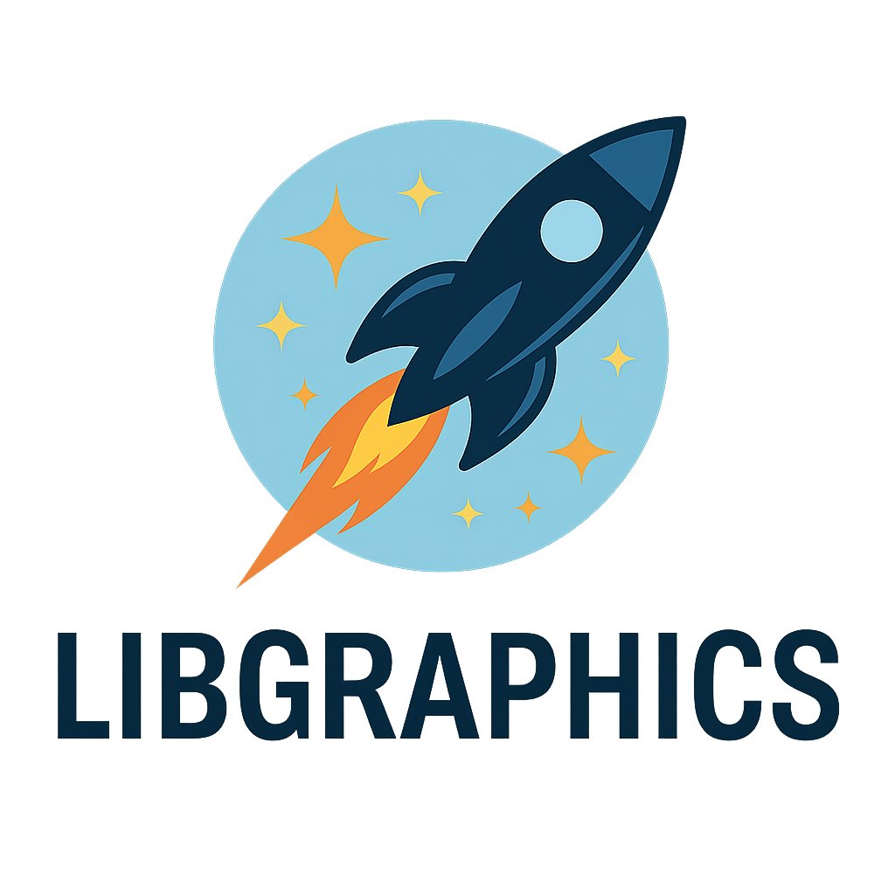

<div align="center">



  
   [](https://opensource.org/licenses/MIT)
  [](https://github.com/johnnymast/LibGraphics/actions/workflows/testing.yml)
</div>

<div align="center">

Lorem ipsum dolor sit amet, consectetur adipiscing elit. Quisque in vestibulum arcu, accumsan luctus velit. In arcu felis, bibendum nec ligula non, consectetur rutrum dui. Nam rutrum enim sed metus tempus fringilla. Donec pharetra libero eu nunc placerat, a ornare metus gravida. Fusce id tellus vitae nisl aliquet placerat vel eget purus. Nam imperdiet volutpat ipsum vitae faucibus. Donec purus nulla, porttitor et euismod sed, maximus non enim.
<br>
<br>

---

**[<kbd> <br> Install <br> </kbd>](#Installation)**
**[<kbd> <br> License <br> </kbd>](LICENSE.md)** 

---

<br>

</div>


A lightweight C++ library for image manipulation designed specifically for AI projects. LibGraphics provides a clean, modern interface for common image processing operations, built on top of OpenCV.


## TODO

- [ ] Converter::imageToPix does not work also there is no test once fixed enable it in the ocr 
- [ ] Fix unit tests for LibGraphics/Image to use depricated functions
- [ ] Unit test LibGraphics/utils/Converter TEST_CASE("Converter::ImageToMat - Valid Image", "[Converter]") color check fails
- [ ] Unit test LibGraphics/utils/Converter.hpp add tests for imageToPix()

## Features

- 🚀 Modern C++17 implementation
- 🖼️ Easy-to-use image manipulation API
- 🤖 Optimized for AI/ML workflows
- 📦 Cross-platform support (Windows, Linux, macOS)
- ⚡ Built on OpenCV for high performance
- 🔧 CMake-based build system

## License

This project is licensed under the MIT License - see the [LICENSE.md](LICENSE.md) file for details.

## Prerequisites


```bash
sudo pacman -S --needed \
abseil-cpp cblas ffmpeg freetype2 gcc-libs glib2 glibc \
gst-plugins-base gst-plugins-base-libs gstreamer harfbuzz lapack \
libdc1394 libglvnd libjpeg-turbo libjxl libpng libtiff libwebp \
openexr openjpeg2 protobuf zlib hdf5 vtk tesseract tesseract-data-osd tesseract-data-eng 
```

- C++17 compatible compiler
- CMake 3.15 or higher
- OpenCV 4.x
- extra/tesseract 5.5.1-1 [installed]
- extra/`tesseract-data-eng` 2:4.1.0-4 (tesseract-data) [installed]
- extra/tesseract-data-osd 2:4.1.0-4 [installed]

## Installation

### Building from Source

1. Clone the repository:
```bash
git clone https://github.com/yourusername/LibGraphics.git
cd LibGraphics
```

2. Create a build directory

```bash
mkdir build
cd build
```


3. Configure and build:

```bash
cmake ..
cmake --build .
```

4. (Optional) Install the library:

```bash
cmake --install .
```


## License

Copyright (c) 2025 Johnny Mast <mastjohnny@gmail.com>

> Permission is hereby granted, free of charge, to any person obtaining a copy
> of this software and associated documentation files (the "Software"), to deal
> in the Software without restriction, including without limitation the rights
> to use, copy, modify, merge, publish, distribute, sublicense, and/or sell
> copies of the Software, and to permit persons to whom the Software is
> furnished to do so, subject to the following conditions:
>
> The above copyright notice and this permission notice shall be included in
> all copies or substantial portions of the Software.
>
> THE SOFTWARE IS PROVIDED "AS IS", WITHOUT WARRANTY OF ANY KIND, EXPRESS OR
> IMPLIED, INCLUDING BUT NOT LIMITED TO THE WARRANTIES OF MERCHANTABILITY,
> FITNESS FOR A PARTICULAR PURPOSE AND NONINFRINGEMENT. IN NO EVENT SHALL THE
> AUTHORS OR COPYRIGHT HOLDERS BE LIABLE FOR ANY CLAIM, DAMAGES OR OTHER
> LIABILITY, WHETHER IN AN ACTION OF CONTRACT, TORT OR OTHERWISE, ARISING FROM,
> OUT OF OR IN CONNECTION WITH THE SOFTWARE OR THE USE OR OTHER DEALINGS IN
> THE SOFTWARE.